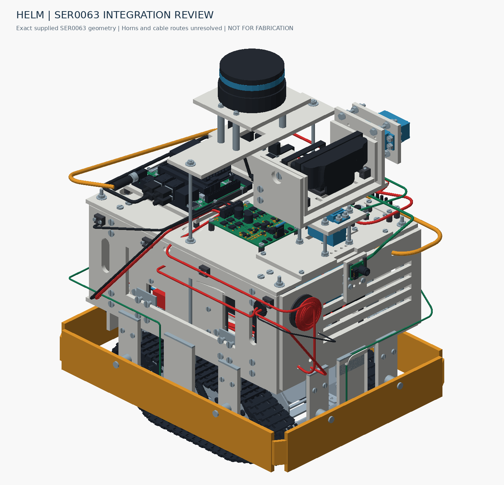

# HELM 자율점검 로봇

HELM의 기구 CAD, 구매 부품, 도면, 제작 준비, 조립·배선 확인과 검증 기록을 모은 저장소입니다.

> **현재: SER0063 교체 검토본. 재단·통전용 최종 승인본이 아닙니다.** 혼 실측, 기존 체결부 간섭, 강도와 전기 통합 검증이 남아 있습니다. 예전 파일명의 FINAL/PASS는 현재 제작 승인을 뜻하지 않습니다.

## 처음 시작할 때

1. [현재 상태와 다음 작업](docs/00-status.md)을 확인합니다.
2. [전체 구성](docs/01-overview.md)과 [구매품 적용 기준](docs/02-parts.md)을 읽습니다.
3. [최신 변경 도면 PDF 6쪽](drawings/ser0063-review/HELM_SER0063_CHANGE_GUIDE_KO.pdf)를 엽니다.
4. 전체 CAD는 [자료 다운로드·복원](docs/11-artifacts.md)에 따라 받습니다.
5. [재단](docs/04-fabrication.md) → [조립](docs/05-assembly.md) → [배선](docs/06-electrical.md) → [검증](docs/08-validation.md) 순서로 준비합니다.

| 찾는 자료 | 바로가기 |
|---|---|
| 1차 29품목 / 2차 64행 | [1차](docs/parts/first-purchase.md) · [2차](docs/parts/second-purchase.md) |
| 부품 비교·교체 판단 | [부품 기준](docs/02-parts.md) |
| 최신 CAD 치수와 변경점 | [CAD 설명](docs/03-cad.md) |
| V13 전체 202쪽 도면 | [과거 기준 PDF](drawings/v13-baseline/HELM_FULL_FABRICATION_AND_ASSEMBLY_DRAWING.pdf) |
| 개별 STEP·DXF | [현재 검토본](cad/ser0063-review/) · [V13](cad/v13-baseline/) |
| 간섭 위치·실측 요청 | [미해결 항목](docs/10-open-items.md) |
| 전체 ZIP·구매 입력 원본 | [아카이브](archives/README.md) |
| CAD/도면 생성 과정 | [재현 방법](docs/12-reproduce.md) |
| 실제 제어 코드 현황 | [소프트웨어](docs/07-software.md) |
| FlutterFlow AI 입력 초안 | [복사용 요구사항](docs/13-flutterflow-ai.md) |
| 작업 이력·변경 규칙 | [이력](docs/09-history.md) · [협업](CONTRIBUTING.md) |

## 계속 유지할 기준

- 1차는 이전 CSV, 2차는 이번 XLSX입니다. 2차 품목을 전부 사용할 필요는 없으며, CAD와 실제 대체품이 다르면 수정합니다.
- 판재는 구매한 **5T 포맥스 600 ×900 mm 2장** 기준입니다. 전체를 바로 재단할 단계는 아닙니다.
- `LIB_SER0063.zip`은 모터 CAD입니다. 혼·리드선 형상은 포함하지 않습니다.
- CAD·파일 검사와 실물 조립·전원·하중·주행 시험을 구분합니다.
- 현재 실행 코드는 CAD 생성·검증 도구입니다. 주행 펌웨어나 자율주행·FlutterFlow 앱 완성본은 확보되지 않았습니다.

설계 기준일 2026-09-30 / 저장소 정리 2026-10-01. [기계가 읽는 상태 기록](data/project-status.json)
