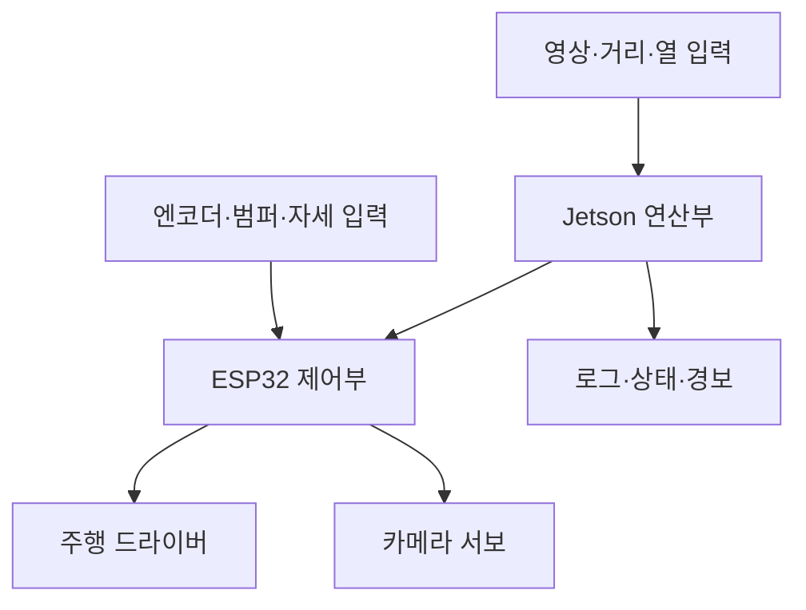

# 전체 구성

기존 도면에서 HELM은 Autonomous Inspection Robot으로 정의된 궤도형 점검 로봇입니다. 아래는 확보된 기구·구매 구성이며 실제 운용 성능 검증 결과가 아닙니다.

| 계통 | 주요 장치 | 역할 |
|---|---|---|
| 이동 | Hiwonder 궤도 섀시·엔코더 모터, MDD10A | 주행 구동 |
| 연산 | Jetson Orin Nano Super 8GB, SSD, AX210 | 연산·저장·통신 |
| 제어 | ESP32 DevKit 38핀 | 저수준 인터페이스 후보, 펌웨어 미확보 |
| 감지 | C920, MLX90640 계열, RPLIDAR A2M12, BNO085 | 영상·열·거리·자세 |
| 카메라 구동 | SER0063 ×2 | 팬·틸트, 혼 미확정 |
| 전원/보호 | AGM 12V 7Ah, 변환기, 배전·퓨즈·릴레이·E-STOP | 실제 결선/정격 확인 필요 |
| 접촉/출력 | 4개 리미트 스위치, USB 스피커 | 범퍼 감지·경보 구성 |

기능 관계도입니다. 확정 배선도나 GPIO 핀맵으로 사용하지 않습니다. 기구는 하부 프레임, 배터리/전원부, 상부 데크, 제어부, LiDAR 타워, 카메라, 범퍼로 구성됩니다.
